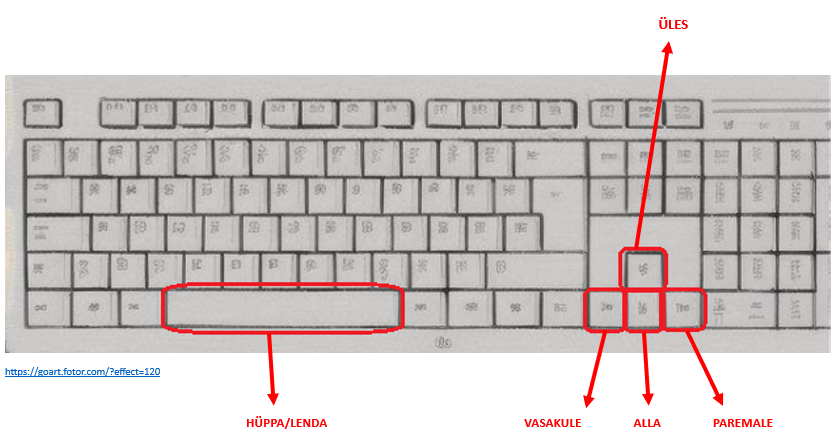

### Kasutaja kontrollisüsteem
Juhendi eesmärk on kirjeldada kuidas mängija kontrollib Timmut. 

## Kontrollimine
- Kasutaja kontrollib Timmut Tühikuga ja noolte klahvidega. Edasi – tagasi liikumiseks vajuta - nooleklahvidel vasakule/paremale. 
- Puuotsa ronimiseks vajuta nooleklahvi üles.
- Puuotsas alla ronimiseks vajuta nooleklahvi alla 
- Hüppamiseks või lendamiseks vajuta tühikut. 

